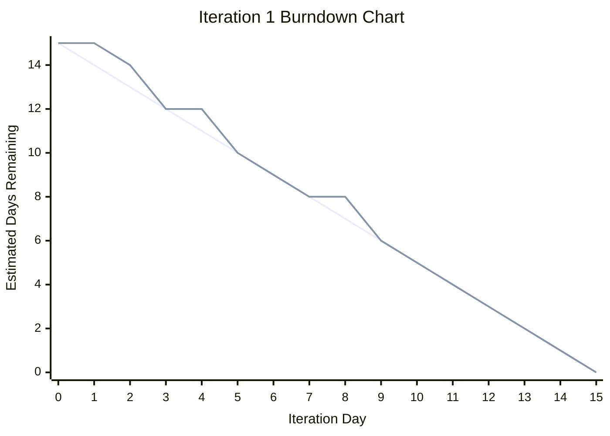
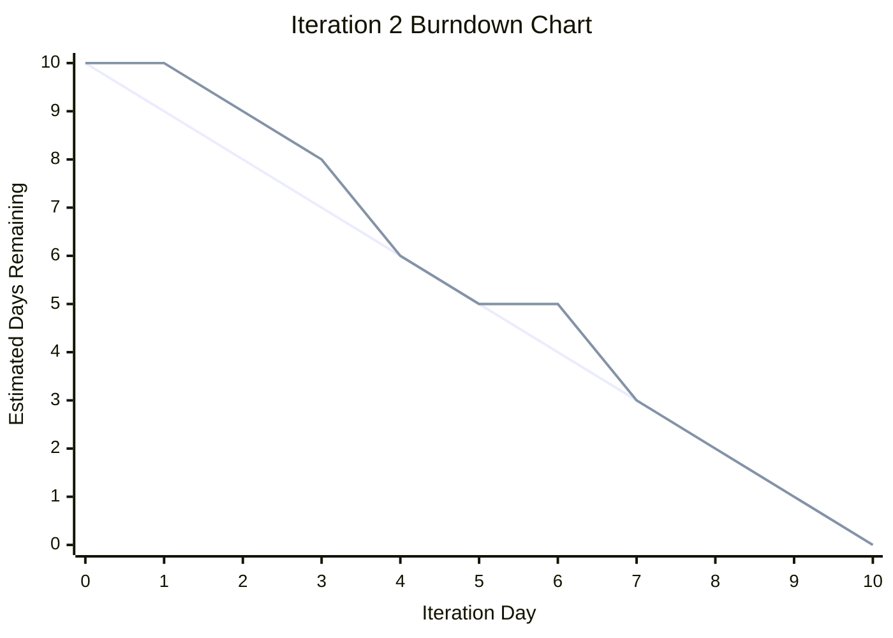

# NewsLens Agile Development Process

## 1. Agile Process Overview

NewsLens was developed using an agile iterative development process. The project was divided into three iterations, with each iteration delivering working features that built on the previous version of the system.

The agile approach helped the project stay organised by using:

- User stories
- Priorities
- Estimates
- Iteration planning
- GitHub Issues
- GitHub Project Board
- Burndown tracking
- Velocity calculation
- Testing and review
- Feedback-based improvements

Since NewsLens was completed as a solo project, the agile process was adapted for one developer while still following iterative planning, tracking, implementation, and review.

---

## 2. Product Backlog

The project backlog was created from the main NewsLens requirements. Each requirement was written as a user story and given a priority and estimate.

| ID | User Story | Priority | Estimate |
|---|---|---:|---:|
| US01 | User Account Access | 10 | 3 days |
| US02 | Multi-Source News Feed | 10 | 4 days |
| US03 | News Categories | 10 | 2 days |
| US04 | Article Detail Page | 10 | 3 days |
| US05 | Search News | 20 | 3 days |
| US06 | Quick Article Summary | 20 | 4 days |
| US07 | Save Articles | 20 | 3 days |
| US08 | Breaking News Alerts | 30 | 3 days |
| US09 | Same-Story Comparison | 30 | 5 days |
| US10 | Bias and Balance Insights | 40 | 5 days |
| US11 | User Preferences | 40 | 3 days |
| US12 | Admin Management | 50 | 4 days |

The stories were prioritised so that the most important foundation features were completed first. Core reading features were placed in Iteration 1, reader usefulness features were placed in Iteration 2, and advanced insight/admin features were placed in Iteration 3.

---

## 3. Priority Justification

| Priority Level | Meaning | Example Stories |
|---|---|---|
| 10 | Essential foundation features | User accounts, news feed, categories, article detail |
| 20 | Important reader functionality | Search, quick summaries, saved articles |
| 30 | Higher-value engagement features | Breaking alerts, source comparison |
| 40 | Advanced insight/personalisation features | Bias insight, user preferences |
| 50 | Admin/support feature | Admin management |

This priority order helped make sure the project delivered what was needed first before adding advanced features.

---

## 4. Iteration Planning

The project was planned across three iterations.

| Iteration | Main Focus | Stories |
|---|---|---|
| Iteration 1 | Core reading system | US01, US02, US03, US04, US05 |
| Iteration 2 | Reader usefulness | US06, US07, US08 |
| Iteration 3 | Advanced insight and management | US09, US10, US11, US12 |

This order was selected because the system needed a working article feed, article pages, categories, and search before summaries, saving, alerts, comparison, and recommendations could be useful.

---

## 5. Iteration 1 Plan and Outcome

Iteration 1 focused on building the foundation of NewsLens.

| User Story | Estimate | Status |
|---|---:|---|
| US01 User Account Access | 3 days | Completed |
| US02 Multi-Source News Feed | 4 days | Completed |
| US03 News Categories | 2 days | Completed |
| US04 Article Detail Page | 3 days | Completed |
| US05 Search News | 3 days | Completed |

Planned work: **15 estimated days**

Completed work: **15 estimated days**

Actual velocity: **15 estimated days**

Iteration 1 successfully delivered the core reading system. Users could access the website, view articles, browse by category, open article detail pages, and search for news.

---

## 6. Iteration 1 Burndown Chart



The burndown chart shows that Iteration 1 had small delays early and in the middle, but the work returned to the planned path and reached zero by the final day.

---

## 7. Iteration 2 Plan and Outcome

Iteration 2 used the Iteration 1 velocity to plan the next set of features.

| User Story | Estimate | Status |
|---|---:|---|
| US06 Quick Article Summary | 4 days | Completed |
| US07 Save Articles | 3 days | Completed |
| US08 Breaking News Alerts | 3 days | Completed |

Planned work: **10 estimated days**

Completed work: **10 estimated days**

Actual velocity: **10 estimated days**

Iteration 2 successfully delivered quick summaries, saved articles, and breaking news alerts. The iteration was planned below the previous velocity of 15 days to allow time for UI improvements and testing.

---

## 8. Iteration 2 Burndown Chart



The Iteration 2 burndown chart shows that work was slightly delayed early in the iteration, but all planned work was completed by Day 10.

---

## 9. Iteration 3 Plan and Outcome

Iteration 3 focused on advanced features and final project completion.

| User Story | Estimate | Status |
|---|---:|---|
| US09 Same-Story Comparison | 5 days | Completed |
| US10 Bias and Balance Insights | 5 days | Completed |
| US11 User Preferences | 3 days | Completed |
| US12 Admin Management | 4 days | Completed |

Planned work: **17 estimated days**

Completed work: **17 estimated days**

Iteration 3 delivered source comparison, bias/balance insight, user preferences, recommendations, and admin management. These features completed the main NewsLens concept by supporting more critical and personalised news reading.

---

## 10. GitHub Project Board

The GitHub Project Board was used to track work during each iteration.

The main workflow was:

```text
Todo → In Progress → Done
```

For bugs, the workflow was expanded to:

```text
Todo → In Progress → Fixed → Verified → Done
```

This board helped show progress clearly and made the work easier to manage.

---

## 11. GitHub Issues and Labels

GitHub Issues were used for user stories, tasks, and bugs.

Common labels included:

| Label | Purpose |
|---|---|
| `user-story` | Identifies a backlog item |
| `bug` | Identifies a defect |
| `testing` | Identifies test-related work |
| `iteration-1` | Work planned for Iteration 1 |
| `iteration-2` | Work planned for Iteration 2 |
| `iteration-3` | Work planned for Iteration 3 |
| `priority-10` | Highest priority foundation item |
| `priority-20` | Important user feature |
| `priority-30` | Medium/high value feature |
| `priority-40` | Advanced feature |
| `priority-50` | Admin/support feature |

Labels helped organise issues and made the priority and iteration of each story clear.

---

## 12. Feedback and Iterative Improvements

Feedback and testing were used after each iteration to improve the system.

| Iteration | Feedback / Issue | Improvement |
|---|---|---|
| Iteration 1 | Article cards needed better presentation | Improved card layout and styling |
| Iteration 1 | Article images were too large or missing | Added image sizing and placeholders |
| Iteration 2 | Breaking news alerts looked too plain | Improved alert section design |
| Iteration 2 | More realistic article content was needed | Added external News API fetching |
| Iteration 3 | Compare Sources visual map needed clearer connections | Improved connector CSS |
| Iteration 3 | Comparison section repeated source card information | Replaced with Comparison Insights |
| Iteration 3 | Buttons were not aligned across cards | Improved card layout using flexbox |

This shows that NewsLens was improved through review, feedback, and iteration rather than being built only once.

---

## 13. Agile Evidence from Practicals

The agile process was supported by the practical work completed throughout the project.

| Practical | Agile Evidence |
|---|---|
| Practical 1 | Repository, README, initial backlog |
| Practical 2 | User stories, priorities, estimates |
| Practical 3 | Iteration planning, project board, burndown |
| Practical 4 | Task breakdown, diagrams, commits, pull request practice |
| Practical 5 | Iteration 1 review, velocity, SRP/DRY review |
| Practical 6 | Iteration 2 planning, tracking, velocity, burndown |
| Practical 7 | TDD planning and automated tests |
| Practical 8 | Iteration 3 TDD practice and mock object testing |
| Practical 9 | Bug tracking and system testing plan |

---

## 14. Agile Roles in a Solo Project

NewsLens was completed by one developer, so agile roles were adapted.

| Agile Role | How It Was Handled |
|---|---|
| Product owner | Requirements and priorities were defined from the project idea and user needs |
| Developer | Features were designed and implemented by the solo developer |
| Tester | Automated tests, manual tests, and system tests were performed by the solo developer |
| Scrum/project manager | GitHub Issues, board tracking, burndown, and iteration reviews were maintained by the solo developer |

Even though this was a solo project, the agile process was still useful because it gave structure to planning, coding, testing, and reviewing.

---

## 15. Version Control in the Agile Process

Git and GitHub supported agile development by recording development progress throughout the project.

Version control was used for:

- Saving work in commits
- Tracking feature development
- Recording documentation updates
- Managing practical evidence
- Pushing work to the remote repository
- Showing iterative progress over time

Example commit types included:

```text
Add Practical 7 TDD testing documentation and automated tests
Add mock object tests for News API fetch command
Add Practical 9 bug tracking and system testing documentation
Add design documentation for major components
```

This commit history provides evidence that the project was developed incrementally.

---

## 16. Agile Testing Approach

Testing was included as part of the agile process rather than left until the end.

Testing included:

- Automated Django tests
- Test-driven development practice
- Mock object testing
- Acceptance testing
- System testing
- Manual UI testing

The final automated test result was:

```text
Ran 23 tests in 7.379s

OK
Destroying test database for alias 'default'...
```

Testing helped confirm that completed features matched the planned user stories.

---

## 17. Agile Process Reflection

The agile approach helped keep NewsLens realistic and manageable. The project started with the most important foundation features, then added usefulness features, and finally added advanced insight and management features.

The most useful agile practices were:

- Writing user stories
- Estimating work
- Prioritising the backlog
- Planning iterations
- Tracking progress with a board
- Reviewing velocity
- Using burndown charts
- Testing completed features

The project also showed that agile development can work for a solo developer when the process is adapted carefully.

---

## 18. Agile Process Summary

NewsLens applied agile iterative development through a clear backlog, three planned iterations, user story priorities, estimates, GitHub Issues, GitHub Project Board tracking, burndown charts, velocity calculation, testing, feedback, and review.

The final system delivered the planned features across three iterations and matched the original project goal: to create a smart news platform that helps users read, organise, and compare news more critically.