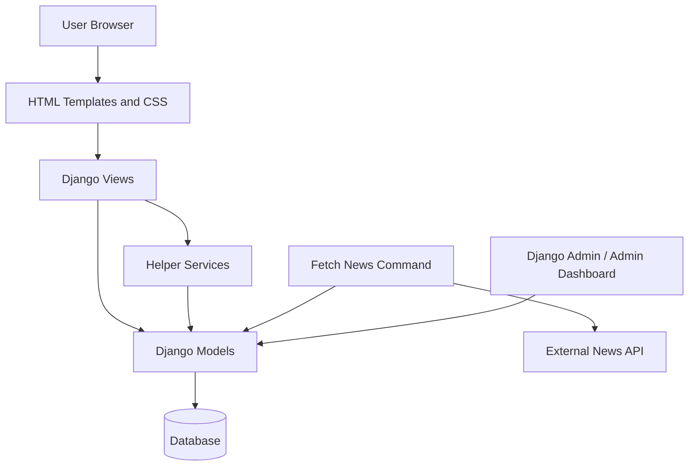
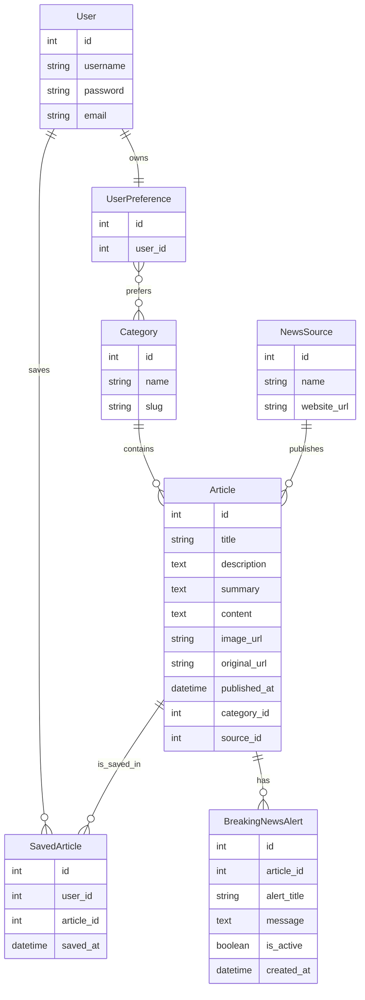
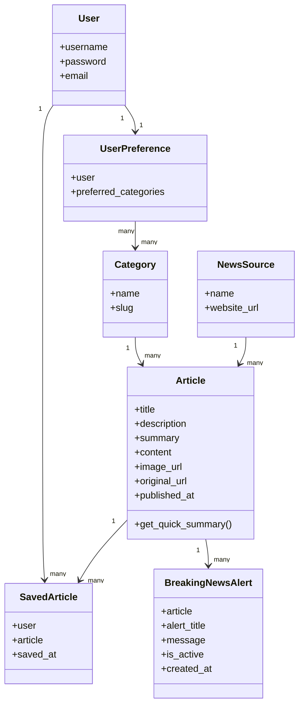
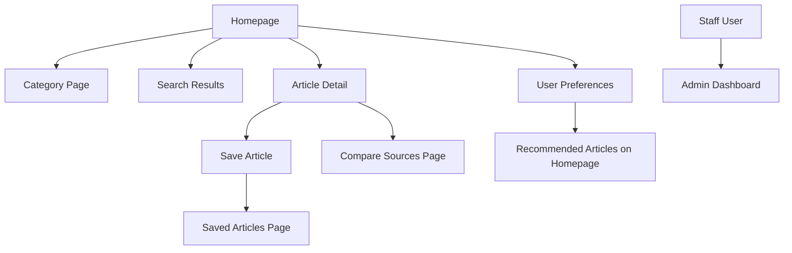
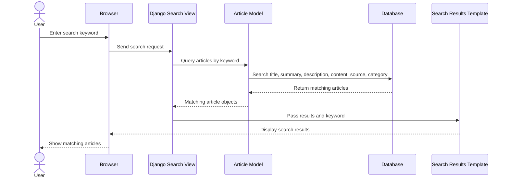
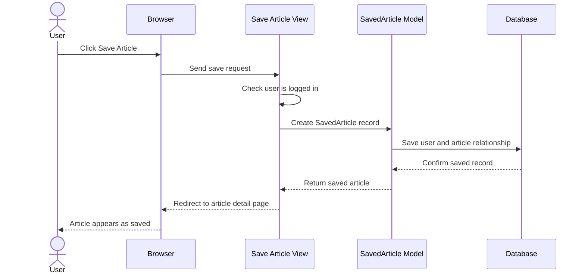
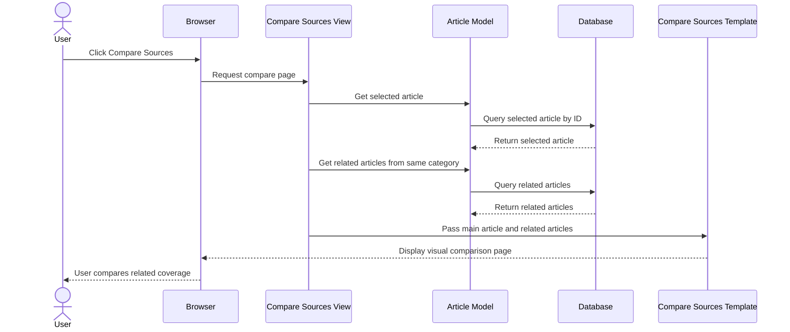

# NewsLens Design Documentation

## 1. Design Overview

NewsLens is a smart news aggregation and bias insight platform. The system allows users to read news articles, browse categories, search for articles, save articles, view breaking news alerts, compare related coverage, and review bias/balance insights.

The design was created to support the main project requirements and user stories. The system uses a Django web application structure, where models manage data, views handle user requests, templates display the interface, and helper services support reusable logic such as quick summaries and bias insight generation.

The design focuses on:

- Clear separation of responsibilities
- Simple and maintainable database structure
- User-friendly interface design
- Support for iterative feature development
- Testable components

---

## 2. Architectural Design

NewsLens follows a Model-View-Template architecture using Django.

## 3. Architecture Explanation

The main architectural components are:

| Component | Purpose |
|---|---|
| User Browser | Allows readers and admins to interact with NewsLens |
| HTML Templates and CSS | Display pages such as homepage, article detail, saved articles, and compare sources |
| Django Views | Handle user requests and return the correct page or action |
| Django Models | Store and manage articles, categories, sources, saved articles, alerts, and preferences |
| Database | Stores all application data |
| Helper Services | Provide reusable logic such as quick summaries and bias insight |
| Fetch News Command | Retrieves article data from the external News API |
| Django Admin / Admin Dashboard | Allows admin users to manage and review system data |

This design was selected because Django supports rapid development, authentication, database models, admin management, testing, and template-based web pages. This made it suitable for a solo agile project with three short development iterations.

---

## 4. Major Components

### 4.1 User Account Component

The user account component supports registration, login, logout, saved articles, and user preferences.

Main features:

- User registration
- User login and logout
- Logged-in users can save articles
- Logged-in users can select preferred categories
- Homepage recommendations use saved user preferences

Related user stories:

| User Story | Feature |
|---|---|
| US01 | User Account Access |
| US07 | Save Articles |
| US11 | User Preferences |

---

### 4.2 Article Feed Component

The article feed component displays the main list of articles on the homepage. It shows article title, source, category, published date, quick summary, and link to read more.

Main features:

- Latest articles
- Multi-source article feed
- Article cards
- Category display
- Quick summary display
- Image placeholder for articles without images

Related user stories:

| User Story | Feature |
|---|---|
| US02 | Multi-Source News Feed |
| US04 | Article Detail Page |
| US06 | Quick Article Summary |

---

### 4.3 Category Component

The category component allows users to browse articles by topic. Categories include areas such as technology, sports, business, entertainment, and other news groups.

Main features:

- Category links
- Category filtered pages
- Homepage category sections
- Article grouping by category

Related user story:

| User Story | Feature |
|---|---|
| US03 | News Categories |

---

### 4.4 Search Component

The search component allows users to search for articles using keywords. It searches article information such as title, description, summary, content, source, and category.

Main features:

- Search bar
- Search results page
- Keyword matching
- Empty result handling

Related user story:

| User Story | Feature |
|---|---|
| US05 | Search News |

---

### 4.5 Breaking News Alert Component

The breaking news alert component highlights urgent or important news on the homepage. Admin users can manage alerts, and only active alerts are displayed to readers.

Main features:

- Breaking alert model
- Active/inactive alert status
- Homepage breaking news section
- Admin management through Django admin

Related user story:

| User Story | Feature |
|---|---|
| US08 | Breaking News Alerts |

---

### 4.6 Source Comparison Component

The source comparison component allows readers to compare related articles from different sources. It includes a selected article, related source cards, a visual source map, and comparison guidance.

Main features:

- Compare Sources page
- Main selected article
- Related articles from the same category
- Visual source map
- Comparison insight cards
- Links to related article details

Related user story:

| User Story | Feature |
|---|---|
| US09 | Same-Story Comparison |

---

### 4.7 Bias and Balance Insight Component

The bias and balance insight component gives readers simple guidance about article wording and source balance. It does not claim to fully determine political bias. Instead, it encourages users to compare coverage before forming an opinion.

Main features:

- Source context
- Category context
- Wording style detection
- Strong word count
- Balance reminder
- Article detail insight panel

Related user story:

| User Story | Feature |
|---|---|
| US10 | Bias and Balance Insights |

---

### 4.8 Admin Management Component

The admin management component supports content review and system management. Django admin is used for managing database records, while a custom admin dashboard provides a summary of system data.

Main features:

- Django admin registration
- Staff-only dashboard
- Article count
- Category count
- Source count
- Saved article count
- Breaking alert count

Related user story:

| User Story | Feature |
|---|---|
| US12 | Admin Management |

---

## 5. Database Design

The database design stores articles, sources, categories, saved articles, breaking news alerts, and user preferences.

---

## 6. Database Table Explanation

| Table | Purpose |
|---|---|
| User | Stores Django user accounts |
| Category | Stores article categories |
| NewsSource | Stores news source information |
| Article | Stores article information |
| SavedArticle | Stores articles saved by users |
| BreakingNewsAlert | Stores homepage breaking news alerts |
| UserPreference | Stores user category preferences |

The database design supports all major project features. Articles are connected to categories and sources, which allows filtering, searching, and comparison. SavedArticle connects users to articles, which supports personalised saved lists. UserPreference connects users to preferred categories, which supports homepage recommendations.

---

## 7. Class Design

The main classes in NewsLens are represented by Django models.

---

## 8. Interface Design

The interface design was created to make NewsLens simple to use. The main design goal was to let users quickly find, read, save, and compare news articles.

Main interface pages:

| Page | Purpose |
|---|---|
| Homepage | Shows latest articles, category sections, breaking alerts, and recommendations |
| Category Page | Shows articles from one category |
| Search Results Page | Shows articles matching the search keyword |
| Article Detail Page | Shows full article information, quick summary, bias insight, save button, and original source link |
| Saved Articles Page | Shows articles saved by the logged-in user |
| Compare Sources Page | Shows related coverage and visual comparison |
| Preferences Page | Allows logged-in users to choose preferred categories |
| Admin Dashboard | Shows system statistics for staff users |

---

## 9. Interface Flow

---

## 10. Key UI Design Decisions

| UI Decision | Justification |
|---|---|
| Card-based article layout | Makes articles easy to scan quickly |
| Category navigation | Helps users browse by topic |
| Quick summaries | Helps users understand articles faster |
| Breaking news section | Makes urgent news more visible |
| Placeholder image design | Keeps layout consistent when article images are missing |
| Compare Sources page | Supports critical reading and multiple perspectives |
| Bias insight panel | Encourages users to think about wording and balance |
| Saved articles page | Gives logged-in users personal reading storage |
| Preferences page | Supports personalised recommendations |
| Staff dashboard | Gives admin users a quick system overview |

---

## 11. Sequence Design: Search News

---

## 12. Sequence Design: Save Article

---

## 13. Sequence Design: Compare Sources

---

## 14. Design Justification

The design supports the project requirements because each major user story is connected to a clear system component. The Django architecture made it possible to build the system iteratively across three iterations.

The database design is simple but effective because it stores only the data needed for the planned features. The interface design focuses on usability, with article cards, summaries, category browsing, saved articles, comparison pages, and clear navigation.

The design also supports testing because models, views, helper services, and templates can be tested separately. Mock object testing was also possible because the external News API dependency was isolated in the fetch command.

Overall, the design allowed NewsLens to deliver the planned requirements on time while keeping the system maintainable and understandable.