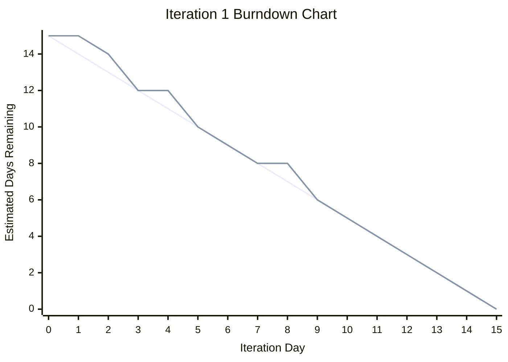
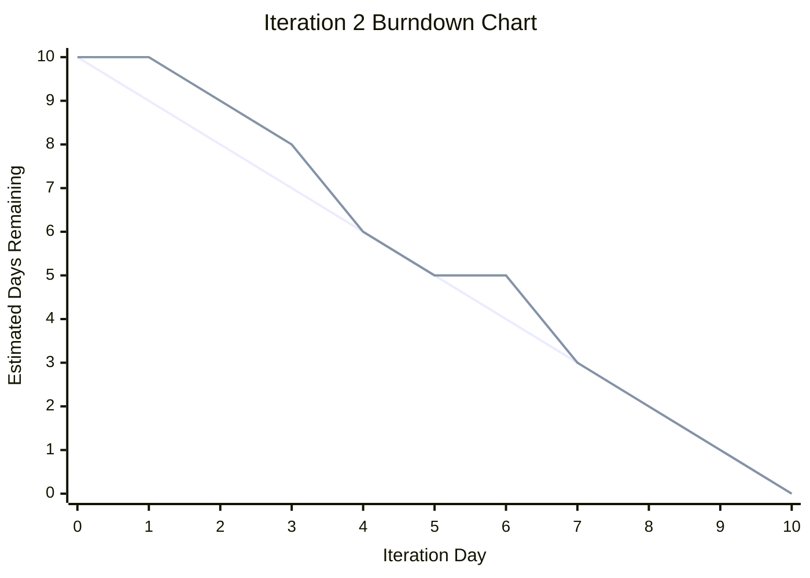

# Practical 6: Iteration 2 Planning, Tracking, and Review

## 1. Practical Objective

The objective of Practical 6 was to use the actual results from Iteration 1 to plan and monitor Iteration 2. This included using the Iteration 1 velocity, updating the backlog, creating an Iteration 2 plan, tracking Iteration 2 progress, reviewing completed and unfinished work, and preparing GitHub Pages evidence for the completed Iteration 2 user stories.

Iteration 2 focused on improving the usefulness of NewsLens by adding article summaries, saved articles, and breaking news alerts.

---

## 2. Iteration 1 Velocity Used for Planning

In Practical 5, the actual velocity for Iteration 1 was calculated.

| Iteration | Planned Work | Completed Work | Actual Velocity |
|---|---:|---:|---:|
| Iteration 1 | 15 days | 15 days | 15 days |

The Iteration 1 velocity was **15 estimated days**.

This meant that Iteration 2 should not exceed approximately 15 estimated days of planned work. Since NewsLens is a solo project, this helped keep the next iteration realistic.

---

## 3. Iteration 1 Burn-down Review

The Iteration 1 burn-down chart was reviewed before starting Iteration 2. The planned line shows the ideal rate of progress, while the actual line shows how the work was completed during development.



### Iteration 1 Burn-down Data

| Day | Planned Work Remaining | Actual Work Remaining |
|---:|---:|---:|
| 0 | 15 | 15 |
| 1 | 14 | 15 |
| 2 | 13 | 14 |
| 3 | 12 | 12 |
| 4 | 11 | 12 |
| 5 | 10 | 10 |
| 6 | 9 | 9 |
| 7 | 8 | 8 |
| 8 | 7 | 8 |
| 9 | 6 | 6 |
| 10 | 5 | 5 |
| 11 | 4 | 4 |
| 12 | 3 | 3 |
| 13 | 2 | 2 |
| 14 | 1 | 1 |
| 15 | 0 | 0 |

---

## 4. Iteration 1 Burn-down Interpretation

The Iteration 1 burn-down showed small delays at the beginning and middle of the iteration, but the work returned to the planned line and reached zero by the final day. The actual work remaining was slightly higher than planned on Day 1, Day 2, Day 4, and Day 8, which suggests small delays during the iteration.

However, the project recovered after each delay and reached zero remaining work by Day 15. This means the selected stories were manageable and the estimates were mostly accurate.

Because Iteration 1 reached zero remaining work, no unfinished Iteration 1 stories needed to be moved into Iteration 2.

---

## 5. Backlog Update After Iteration 1

After Iteration 1, the following user stories were completed:

| ID | User Story | Status |
|---|---|---|
| US01 | User Account Access | Completed |
| US02 | Multi-Source News Feed | Completed |
| US03 | News Categories | Completed |
| US04 | Article Detail Page | Completed |
| US05 | Search News | Completed |

The remaining backlog after Iteration 1 was:

| ID | User Story | Priority | Estimate | Planned Iteration |
|---|---|---:|---:|---|
| US06 | Quick Article Summary | 20 | 4 days | Iteration 2 |
| US07 | Save Articles | 20 | 3 days | Iteration 2 |
| US08 | Breaking News Alerts | 30 | 3 days | Iteration 2 |
| US09 | Same-Story Comparison | 30 | 5 days | Iteration 3 |
| US10 | Bias and Balance Insights | 40 | 5 days | Iteration 3 |
| US11 | User Preferences | 40 | 3 days | Iteration 3 |
| US12 | Admin Management | 50 | 4 days | Iteration 3 |

---

## 6. Iteration 2 User Stories Selected

Based on the Iteration 1 velocity of 15 days, the following stories were selected for Iteration 2.

| ID | User Story | Priority | Estimate | Reason Selected |
|---|---|---:|---:|---|
| US06 | Quick Article Summary | 20 | 4 days | Improves article readability |
| US07 | Save Articles | 20 | 3 days | Adds personal user functionality |
| US08 | Breaking News Alerts | 30 | 3 days | Highlights urgent news |

Total planned Iteration 2 estimate: **10 days**

The total planned work for Iteration 2 was 10 estimated days, which was below the Iteration 1 velocity of 15 days. This gave room for UI improvements, testing, and small fixes.

---

## 7. Iteration 2 Task Breakdown

### US06: Quick Article Summary

| Task ID | Task | Estimate | Status |
|---|---|---:|---|
| T23 | Create summary helper function | 1 day | Done |
| T24 | Add `get_quick_summary()` method to Article model | 0.75 day | Done |
| T25 | Display quick summary on article cards | 0.75 day | Done |
| T26 | Display quick summary on article detail page | 0.75 day | Done |
| T27 | Test summary fallback when summary text is missing | 0.75 day | Done |

Total: **4 days**

### US07: Save Articles

| Task ID | Task | Estimate | Status |
|---|---|---:|---|
| T28 | Create SavedArticle model | 0.75 day | Done |
| T29 | Add save article view | 0.75 day | Done |
| T30 | Add remove saved article view | 0.5 day | Done |
| T31 | Create saved articles page | 0.75 day | Done |
| T32 | Test saving/removing articles while logged in | 0.25 day | Done |

Total: **3 days**

### US08: Breaking News Alerts

| Task ID | Task | Estimate | Status |
|---|---|---:|---|
| T33 | Create BreakingNewsAlert model | 0.75 day | Done |
| T34 | Register alerts in Django admin | 0.25 day | Done |
| T35 | Display active alerts on homepage | 0.75 day | Done |
| T36 | Improve breaking news alert layout | 0.75 day | Done |
| T37 | Test active/inactive alert display | 0.5 day | Done |

Total: **3 days**

---

## 8. Iteration 2 Burn-down Chart

The Iteration 2 burn-down chart tracked the planned work remaining against the actual work remaining across the 10-day iteration.



### Iteration 2 Burn-down Data

| Day | Planned Work Remaining | Actual Work Remaining |
|---:|---:|---:|
| 0 | 10 | 10 |
| 1 | 9 | 10 |
| 2 | 8 | 9 |
| 3 | 7 | 8 |
| 4 | 6 | 6 |
| 5 | 5 | 5 |
| 6 | 4 | 5 |
| 7 | 3 | 3 |
| 8 | 2 | 2 |
| 9 | 1 | 1 |
| 10 | 0 | 0 |

---

## 9. Iteration 2 Burn-down Interpretation

The Iteration 2 burn-down showed a small delay early in the iteration because the save article feature needed authentication checks and template changes. The actual line was above the planned line on Day 1, Day 2, Day 3, and Day 6.

However, the work returned to the expected path and reached zero by the end of the iteration. The final result was successful because all planned Iteration 2 user stories were completed.

---

## 10. Completed and Unfinished Stories

### Completed Stories

| ID | User Story | Estimate | Status |
|---|---|---:|---|
| US06 | Quick Article Summary | 4 days | Completed |
| US07 | Save Articles | 3 days | Completed |
| US08 | Breaking News Alerts | 3 days | Completed |

Total completed work: **10 days**

### Unfinished Stories

| ID | User Story | Status |
|---|---|---|
| None | No Iteration 2 stories unfinished | Not applicable |

All Iteration 2 stories were completed. No planned story needed to be moved to Iteration 3.

---

## 11. Iteration 2 Actual Velocity

```text
Actual Velocity = Completed Estimate
Actual Velocity = 10 days
```

The actual velocity for Iteration 2 was **10 estimated days**.

This was lower than Iteration 1 velocity because Iteration 2 was planned with a smaller scope. This was intentional because Iteration 2 included more user-facing features, template updates, authentication checks, and UI improvements.

---

## 12. SRP and DRY Review

During Iteration 2, the project was reviewed for Single Responsibility Principle and Don't Repeat Yourself issues.

### SRP Review

The project followed SRP by keeping different responsibilities separated:

| Component | Responsibility |
|---|---|
| Models | Store article, saved article, and alert data |
| Views | Handle page requests and user actions |
| Templates | Display the interface |
| Services/helper functions | Generate summaries and reusable logic |
| Admin | Support content management |

This helped keep the project easier to maintain because each file had a clear purpose.

### DRY Review

Several repeated behaviours were reduced:

| Repeated Area | Improvement |
|---|---|
| Article summary display | Used `get_quick_summary()` instead of manually writing summary logic in templates |
| Article cards | Reused consistent card layout and CSS |
| Save/remove behaviour | Used shared model relationship through `SavedArticle` |
| Breaking news display | Used active alerts from the database rather than hard-coded homepage content |

The main DRY improvement was placing quick summary logic in one model/helper method instead of repeating summary fallback logic in different templates.

---

## 13. GitHub Board Monitoring

The GitHub project board was monitored during Iteration 2 using the same workflow:

- Todo
- In Progress
- Done

The selected Iteration 2 user stories were moved across the board as development progressed.

| Issue | Labels | Final Status |
|---|---|---|
| US06 - Quick Article Summary | `user-story`, `iteration-2`, `priority-20` | Done |
| US07 - Save Articles | `user-story`, `iteration-2`, `priority-20` | Done |
| US08 - Breaking News Alerts | `user-story`, `iteration-2`, `priority-30` | Done |

---

## 14. GitHub Pages Evidence for Iteration 2

GitHub Pages evidence was prepared for the completed Iteration 2 user stories.

Suggested user story pages:

```text
docs/user-stories/us06-quick-article-summary.md
docs/user-stories/us07-save-articles.md
docs/user-stories/us08-breaking-news-alerts.md
```

These pages provide evidence for the completed stories, including the user story, priority, estimate, tasks completed, testing notes, and final status.

---

## 15. GitHub Page Content for Iteration 2 Stories

### US06: Quick Article Summary

```markdown
# US06: Quick Article Summary

## User Story

As a reader, I want a quick summary for each article so that I can understand the main idea without reading the full article immediately.

## Priority

20

## Estimate

4 days

## Iteration

Iteration 2

## Tasks Completed

- Created a summary helper function.
- Added a `get_quick_summary()` method to the Article model.
- Displayed quick summaries on article cards.
- Displayed quick summaries on the article detail page.
- Tested fallback behaviour when summary text was missing.

## Evidence of Completion

Article cards and article detail pages now show a short quick summary. If the article already has a summary, that summary is displayed. If not, the system can fall back to other available article text.

## Testing Notes

The feature was tested using articles with summaries, articles with only descriptions, and articles with missing text.

## Final Status

Completed
```

### US07: Save Articles

```markdown
# US07: Save Articles

## User Story

As a logged-in user, I want to save articles so that I can return to them later.

## Priority

20

## Estimate

3 days

## Iteration

Iteration 2

## Tasks Completed

- Created the SavedArticle model.
- Added save article view.
- Added remove saved article view.
- Created saved articles page.
- Added save/remove buttons to the article detail page.
- Tested saving and removing articles while logged in.

## Evidence of Completion

Logged-in users can save articles from the article detail page and view them on a saved articles page. Saved articles can also be removed.

## Testing Notes

The feature was tested with a logged-in user to confirm that saved article records were created and deleted correctly.

## Final Status

Completed
```

### US08: Breaking News Alerts

```markdown
# US08: Breaking News Alerts

## User Story

As a reader, I want to see breaking news alerts so that I can quickly notice important or urgent news.

## Priority

30

## Estimate

3 days

## Iteration

Iteration 2

## Tasks Completed

- Created the BreakingNewsAlert model.
- Registered alerts in Django admin.
- Displayed active alerts on the homepage.
- Improved the breaking news alert layout.
- Tested active and inactive alert display.

## Evidence of Completion

The homepage displays active breaking news alerts. Inactive alerts are not shown to users.

## Testing Notes

The feature was tested by creating active and inactive alerts and confirming that only active alerts appeared on the homepage.

## Final Status

Completed
```

---

## 16. Update User Story Index

Add this section to:

```text
docs/user-stories/index.md
```

```markdown
## Iteration 2 Completed Stories

| ID | User Story | Priority | Estimate | Status |
|---|---|---:|---:|---|
| US06 | [Quick Article Summary](us06-quick-article-summary.md) | 20 | 4 days | Completed |
| US07 | [Save Articles](us07-save-articles.md) | 20 | 3 days | Completed |
| US08 | [Breaking News Alerts](us08-breaking-news-alerts.md) | 30 | 3 days | Completed |
```

---

## 17. Practical 6 Reflection

Practical 6 helped connect the results of Iteration 1 to the planning of Iteration 2. The Iteration 1 velocity of 15 estimated days was useful because it gave a realistic planning limit for the next iteration.

Iteration 2 was deliberately planned at 10 estimated days instead of using the full 15-day velocity. This made the plan more manageable because the selected features required changes to models, views, templates, authentication behaviour, and homepage layout.

The most useful part of this practical was comparing planned work remaining with actual work remaining. The burn-down data showed where small delays happened, but it also showed that the project recovered and completed the planned work by the end of the iteration.

---

## 18. Practical 6 Summary

Practical 6 used the actual Iteration 1 velocity to plan Iteration 2. The backlog was updated, three user stories were selected, tasks were broken down, burn-down progress was tracked, and completed/unfinished stories were reviewed.

Iteration 2 completed all planned stories: Quick Article Summary, Save Articles, and Breaking News Alerts. The actual Iteration 2 velocity was **10 estimated days**. GitHub Pages evidence was also prepared for the completed Iteration 2 user stories.